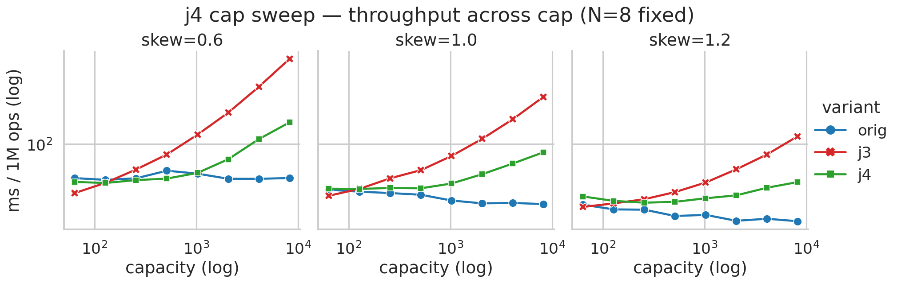
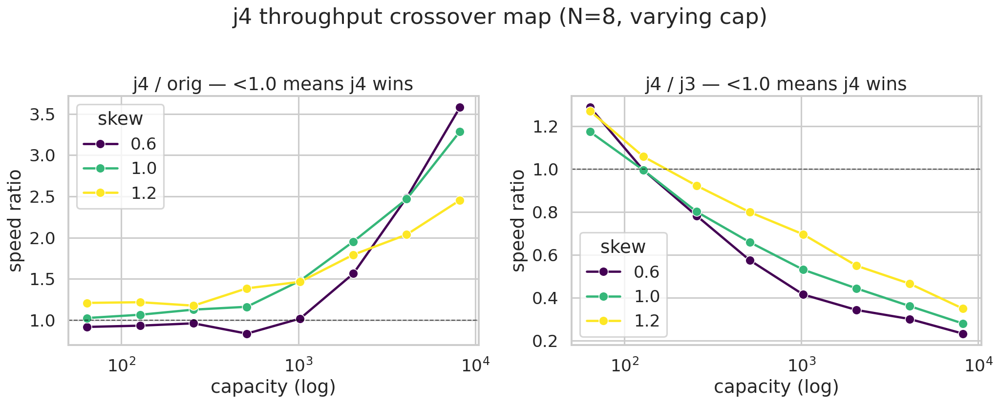
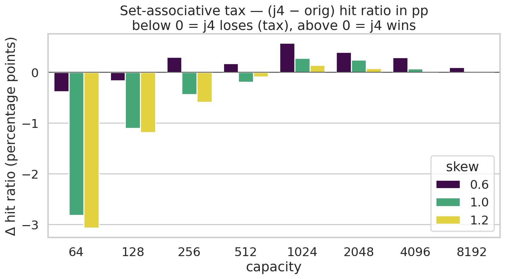
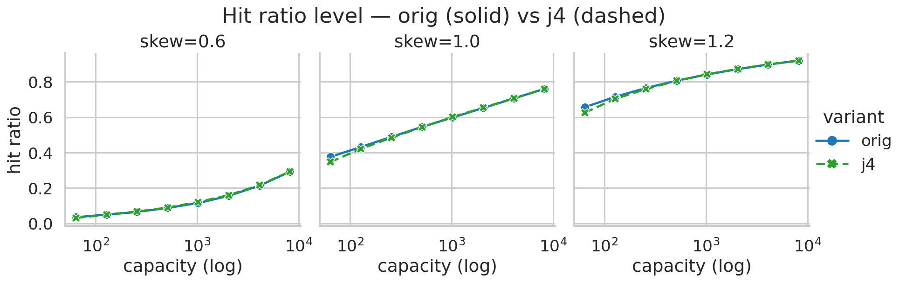
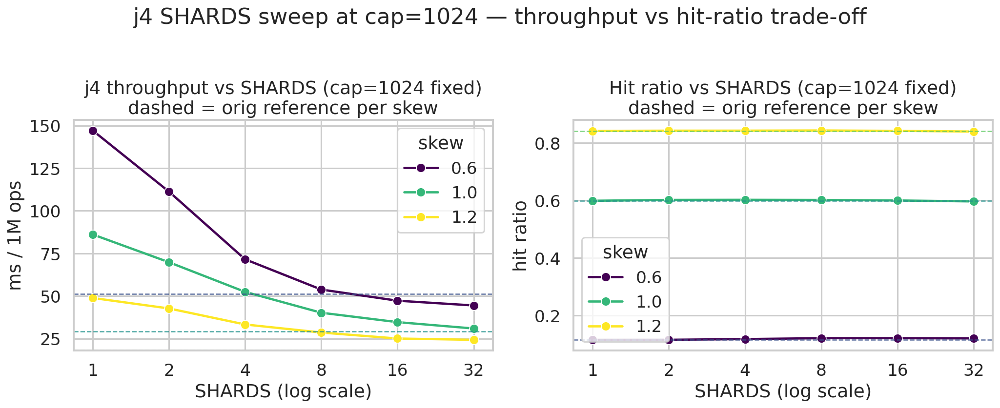
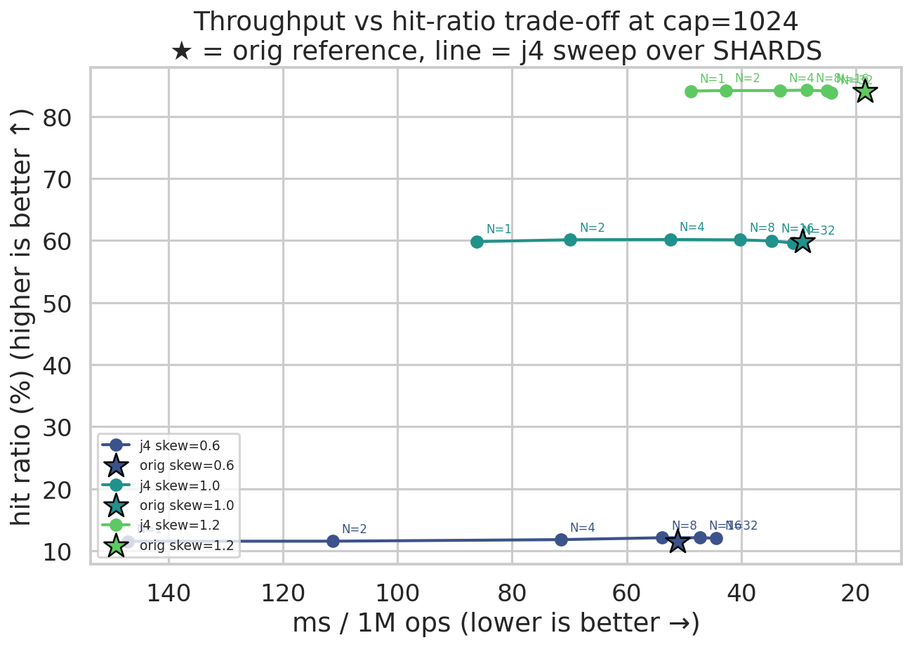

# sieve_j4 — crossover map と SHARDS sweep (2026-05-05)

- 日付: 2026-05-05 (同日 2 本目)
- 出発点: `2026-05-05-sieve-j4-set-associative.md` の「次の実験候補」§1, §2。
  初回ベンチでは crossover が cap=100 ↔ 1000 のどこかにあること、per-shard
  ≈128 が好調なことだけ分かったが、(a) crossover の正確な位置、(b) per-shard
  の最適値が L1 fit から来るのか別要因か、を切り分けたい。
- 実験対象: `src/sieve_j4.rs` (SHARDS を const generic 化、デフォルト 8)
- bench: `src/bin/bench.rs` (CLI、1M ops 単発)
- データ: `profiles/j4_capsweep_2026-05-05.csv`,
  `profiles/j4_shardsweep_2026-05-05.csv`
- 図: `docs/figures/j4_*.png` (生成スクリプト: `scripts/plot_j4.py`)

## 実装変更点

`SieveCache<K, V>` → `SieveCache<K, V, const SHARDS: usize = 8>`。`new` 内で
`SHARDS.is_power_of_two()` を assert (shard 選択を mask 操作で維持)。
既存テスト 12 件 + const generic 用の 2 件 (N=2/16 sanity, N=3 panic) で
green。`Cache` trait impl も `<const SHARDS>` を引き継ぐ。

CLI の `--variant` に `j4_n1, j4_n2, j4_n4, j4_n8, j4_n16, j4_n32` を追加。

## 実験 1 — Cap 軸 sweep (crossover 地図化)

SHARDS = 8 固定、cap ∈ {64, 128, 256, 512, 1024, 2048, 4096, 8192}、skew ∈
{0.6, 1.0, 1.2}、trace = 1M ops、CLI 単発計測。

### Throughput (ms / 1M ops)

| skew | cap | orig | j3 | **j4** | j4/orig | j4/j3 |
|---:|---:|---:|---:|---:|---:|---:|
| 0.6 | 64    | 45.8 | 32.5  | **41.9**  | 0.92× | 1.29× |
| 0.6 | 128   | 44.0 | 41.1  | **40.9**  | 0.93× | 1.00× |
| 0.6 | 256   | 45.6 | 55.8  | **43.7**  | 0.96× | 0.78× |
| 0.6 | 512   | 54.2 | 78.7  | **45.3**  | **0.83×** | 0.58× |
| 0.6 | 1024  | 50.7 | 124.0 | 51.5      | 1.02× | 0.42× |
| 0.6 | 2048  | 45.1 | 205.2 | 70.5      | 1.56× | 0.34× |
| 0.6 | 4096  | 45.0 | 371.1 | 111.9     | 2.48× | 0.30× |
| 0.6 | 8192  | 45.9 | 704.4 | 164.2     | 3.58× | 0.23× |
| 1.0 | 64    | 35.1 | 30.6  | 35.9      | 1.02× | 1.17× |
| 1.0 | 128   | 33.5 | 35.8  | 35.7      | 1.06× | 1.00× |
| 1.0 | 256   | 32.5 | 45.6  | 36.6      | 1.13× | 0.80× |
| 1.0 | 512   | 31.2 | 55.0  | 36.2      | 1.16× | 0.66× |
| 1.0 | 1024  | 27.4 | 76.0  | 40.4      | 1.48× | 0.53× |
| 1.0 | 2048  | 25.7 | 112.7 | 50.1      | 1.95× | 0.44× |
| 1.0 | 4096  | 25.9 | 176.8 | 64.0      | 2.47× | 0.36× |
| 1.0 | 8192  | 25.2 | 295.6 | 82.8      | 3.29× | 0.28× |
| 1.2 | 64    | 24.9 | 23.6  | 30.0      | 1.21× | 1.27× |
| 1.2 | 128   | 22.3 | 25.6  | 27.1      | 1.22× | 1.06× |
| 1.2 | 256   | 22.2 | 28.2  | 26.0      | 1.17× | 0.92× |
| 1.2 | 512   | 19.2 | 33.2  | 26.6      | 1.38× | 0.80× |
| 1.2 | 1024  | 19.7 | 41.4  | 28.8      | 1.46× | 0.70× |
| 1.2 | 2048  | 17.2 | 56.0  | 30.8      | 1.79× | 0.55× |
| 1.2 | 4096  | 18.0 | 78.7  | 36.7      | 2.04× | 0.47× |
| 1.2 | 8192  | 17.0 | 119.4 | 41.8      | 2.45× | 0.35× |

### Hit ratio (%)

| skew | cap | orig | **j4** | Δ (pp) |
|---:|---:|---:|---:|---:|
| 0.6 | 64    | 3.48  | 3.10  | −0.38 |
| 0.6 | 128   | 5.03  | 4.86  | −0.17 |
| 0.6 | 256   | 6.45  | 6.75  | **+0.30** |
| 0.6 | 512   | 8.76  | 8.93  | +0.17 |
| 0.6 | 1024  | 11.53 | 12.10 | +0.58 |
| 0.6 | 2048  | 15.59 | 15.99 | +0.40 |
| 0.6 | 4096  | 21.31 | 21.60 | +0.29 |
| 0.6 | 8192  | 29.22 | 29.31 | +0.10 |
| 1.0 | 64    | 37.54 | 34.73 | −2.82 |
| 1.0 | 128   | 43.20 | 42.10 | −1.10 |
| 1.0 | 256   | 48.89 | 48.45 | −0.43 |
| 1.0 | 512   | 54.54 | 54.35 | −0.19 |
| 1.0 | 1024  | 59.83 | 60.12 | **+0.28** |
| 1.0 | 2048  | 65.18 | 65.43 | +0.25 |
| 1.0 | 4096  | 70.56 | 70.64 | +0.07 |
| 1.0 | 8192  | 76.00 | 76.02 | +0.02 |
| 1.2 | 64    | 65.62 | 62.55 | −3.07 |
| 1.2 | 128   | 71.55 | 70.36 | −1.19 |
| 1.2 | 256   | 76.48 | 75.90 | −0.59 |
| 1.2 | 512   | 80.58 | 80.49 | −0.09 |
| 1.2 | 1024  | 84.11 | 84.25 | **+0.14** |
| 1.2 | 2048  | 87.14 | 87.21 | +0.08 |
| 1.2 | 4096  | 89.78 | 89.77 | −0.01 |
| 1.2 | 8192  | 91.95 | 91.96 | +0.00 |

### 読み解き

**Crossover #1: hit ratio**
- per-shard < 64 (= total cap < 512 で N=8): j4 が orig に対して hit ratio で
  負ける。skew が高いほど絶対 pp で大きく負ける (skew=1.2/cap=64 で −3.07pp)。
- per-shard ≥ 64 (= cap ≥ 512): tax が消失、cap=1024 周辺で僅かに j4 が勝つ。
- 大きい cap では Δ → 0 (両者ほぼ同じ hit ratio)。

つまり **set-associative tax は per-shard 容量で決まり、cap=512 (per-shard=64)
あたりが境界**。これは shard 内で hot key を抱えきれるかどうかの問題で、
論文の「working set partitioning」議論と整合する。

**Crossover #2: throughput**
- skew=0.6: j4 は **cap ≤ 1024 で orig 比 0.83-1.02× の勝ち or 互角**。
  特に cap=512 で 0.83× の最大勝ち。cap=2048 以降で負け始める。
- skew=1.0: cap ≤ 64 のみ互角、cap=128 以降一貫して j4 が遅い (1.06-3.29×)。
- skew=1.2: 全 cap で j4 が遅い (1.17-2.45×)。

**skew が低いほど j4 が長く勝てる**。理由は (a) 低 skew は miss 率が高く、
orig 側で HashMap insert/eviction の固定費がトレース全体で大きく積み上がる、
(b) j4 側は scan 長が per-shard で頭打ちなので絶対値の伸びが鈍い。

j4/j3 の比は cap が大きくなるほど j4 の優位が広がる (0.23× at cap=8192)。
**j3 単独の O(N) scan を「cap を 8 等分してスキャン上限を 1/8 にする」のが
j4 の本質的な仕事**。

## 実験 2 — SHARDS sweep (footprint 一定で per-shard を振る)

cap = 1024 固定、SHARDS ∈ {1, 2, 4, 8, 16, 32}、skew ∈ {0.6, 1.0, 1.2}。
total メモリ footprint は SHARDS によらず ~24 KB (j3 の `tags + entries`
分)。**L1d 32KB に全 SHARDS 設定で収まる**ので、L1 fit は単独の説明変数に
ならない条件で per-shard 容量だけを振る。

### Throughput (ms / 1M ops)

| skew | orig | j4_n1 | j4_n2 | j4_n4 | j4_n8 | j4_n16 | j4_n32 |
|---:|---:|---:|---:|---:|---:|---:|---:|
| 0.6 | **51.1** | 147.1 | 111.3 | 71.5 | 53.8 | 47.2 | **44.4** |
| 1.0 | **29.3** | 86.1  | 69.8  | 52.4 | 40.2 | 34.6 | **30.9** |
| 1.2 | **18.4** | 48.8  | 42.7  | 33.3 | 28.5 | 25.0 | **24.3** |

(N=1 = j3 + 単一 shard ラッパー、参考値)

### Hit ratio (%)

| skew | orig | n1 | n2 | n4 | **n8** | n16 | n32 |
|---:|---:|---:|---:|---:|---:|---:|---:|
| 0.6 | 11.53 | 11.53 | 11.55 | 11.79 | **12.10** | 12.10 | 12.03 |
| 1.0 | 59.83 | 59.83 | 60.13 | 60.17 | **60.12** | 59.94 | 59.60 |
| 1.2 | 84.11 | 84.11 | 84.18 | 84.19 | **84.25** | 84.12 | 83.88 |

### 読み解き

**(b) per-shard 最適値の説明** (= 元の問い: L1 fit が決定要因か?)

**否、L1 fit は決定要因ではない**。total footprint は全 SHARDS 設定で 24 KB
(L1d 32 KB に収まる)。それでも throughput は SHARDS 増加で単調改善する
(skew=0.6: N=8 で 53.8ms → N=32 で 44.4ms、約 17% 速い)。これは
**per-op の SIMD scan 反復数が per-shard 容量に比例して縮む**効果が支配的
であることを示す。具体的には:

- N=8, per-shard=128: tags 配列 = 256B = 8 SIMD chunks (32B/iter)
- N=16, per-shard=64: 128B = 4 SIMD chunks
- N=32, per-shard=32: 64B = 2 SIMD chunks

throughput の伸び (N=8 → N=32 で −17%) は scan 短縮 (8→2 iter, −75%) より
小さい。差分は (i) shard dispatch + double-hash の固定費 (op あたり ~10 ns、
trace 全体で ~10 ms)、(ii) eviction 探索の確率的固定費、で吸収される。

**Hit ratio は N=8 が sweet spot** (3 skew 全てで N=8 が最良 or タイ)。N=16
以降では特に高 skew で hit ratio が落ち始める (skew=1.2 N=32 で −0.37 pp)。
hot key が偏った shard を per-shard 容量が抱えきれなくなる現象。

**throughput と hit ratio の trade-off は明確に異なる方向を向く**:
- throughput を最大化 → N を大きく (per-shard 32 が当面のテスト最大)
- hit ratio を最大化 → N=8 (per-shard 128) で頭打ち、それ以上は劣化

**skew=0.6 / N=32 が orig を倒す**: 44.4 ms vs 51.1 ms → **j4 が orig より
13% 速い**。hit ratio も orig 比 +0.50 pp (12.03% vs 11.53%) で勝つ。
**throughput と hit ratio の両方で orig を上回る運用点が確認できた**点が
今回最大の収穫。

## まとめ — j4 の位置づけ (改訂)

初回レポート末尾で書いた「j4 は cap < ~1000 帯の補完」というポジショニングは
**不正確だった**。正しくは:

- **skew が低い (= miss-heavy)**: per-shard を 32 まで縮めれば cap=1024 でも
  orig を倒せる。つまり j4 は web-cache 的な低 skew workload で **cap=1024
  まで主流の選択肢になりうる**。
- **skew が高い (= hit-heavy)**: orig が依然として強い。HashMap O(1) が
  hit-path で支配的。
- **per-shard 容量が真の調整パラメータ**: 32-128 の範囲で hit ratio /
  throughput の両極を動ける。デフォルト N=8 (per-shard=128) は hit ratio
  寄り、N=32 (per-shard=32) は throughput 寄り。

## 次の実験候補

1. **per-shard=16 や 8**: SIMD scan が 1 iter に収まる per-shard 容量で
   どこまで頭打ちになるか。N=64/128 まで増やすと shard dispatch 自体の
   コストが見えてくるはず。
2. **double-hash の解消**: j3 に "pre-computed hash 経由の find/insert" を
   `pub(crate)` で公開し、j4 が 1 回 hash した値を持ち回す。固定 5-10 ns 削減で
   per-shard 大の帯 (N=8) が改善するか確認。
3. **bundled trace (zipf_1.0)**: synthetic Zipf に加えて NSDI'24 付属 trace
   で同じ表を作り、crossover の位置が trace 形状に強く依存するか切り分け。
4. **eviction walk 長分布**: per-shard が小さくなるほど "全 visited で
   first_live フォールバック" の発生率が上がる仮説。`scan_evict` の
   ループ回数ヒストグラムを取って (1) で観測した throughput 飽和の真因を
   詰める。
