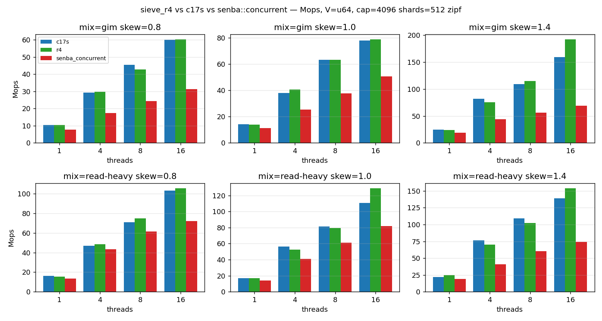
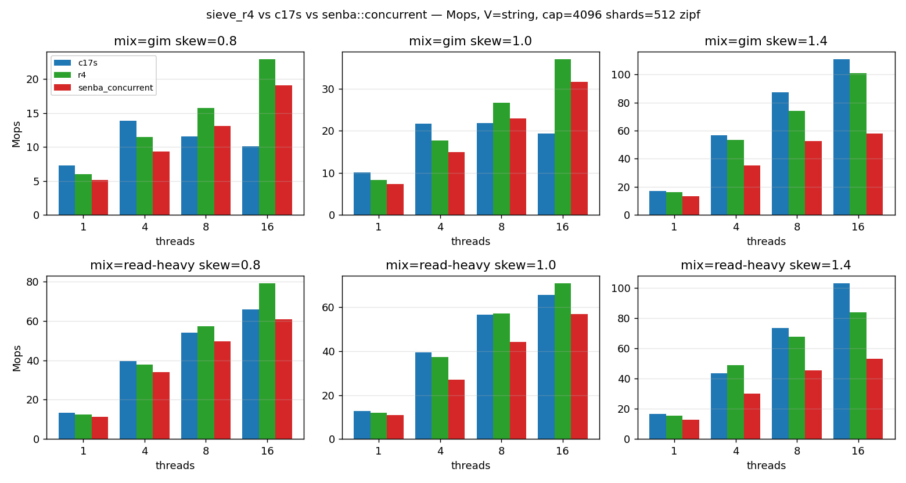

# 2026-05-15 — sieve_r4 vs c17s vs senba::concurrent (3-way 432-cell sweep)

## TL;DR

- **仮説**: c17s の entry-version seqlock を race α 防御に残し、`crossbeam-epoch` を refcount 抜きで race β 防御として被せれば、`senba::concurrent::Cache` (Arc<V>+epoch、median −34% / worst −63% vs c17s — `2026-05-13-senba-concurrent-vs-c17s.md`) の退行を構造的に回収しつつ、c17s の reader hot path atomic shape (write 0) を保てる。
- **やったこと**: `sieve_r4` を c17s skeleton + ManuallyDrop wrap + crossbeam-epoch defer で実装 (設計 `2026-05-14-arc-less-concurrent-design.md`)、3-way 432-cell sweep で計測。
- **分かったこと**:
  - **V=u64 accept PASS** (Copy 特殊化が monomorphize-time fold で完全機能、c17s と median ±0.3% / worst −8.4%)
  - **V=String accept FAIL** (target +30% vs senba に対し median +21.1% / worst +10.2% — Pareto improvement は確認、gap closure は partial)
  - V=String で c17s 比 worst −18.5% は epoch::pin (~5ns) overhead として理解可能だが、**reader が共有 atomic に write しない設計が低 skew で senba 比優位を縮める** — 集中ではなく分散ワークロードで Arc ping-pong の bottleneck が薄まるため。

## 設計差分の振り返り (vs c17s)

c17s からの構造変更は 6 点 (詳細は設計 doc §3-§7):

1. `Entry::key/value` を `ManuallyDrop` で包む → writer Path C で `ManuallyDrop::take` → defer closure に move。
2. reader `get_by_hash` 入口で `pin_for::<V>` を取得。`needs_drop::<V>()` の monomorphize-time fold で V: Copy では消える (release build で `cargo asm` 検証済 — Plan Task 7、V=u64 で 0 件、V=String で 2 件)。
3. reader `try_candidate` の v1/v2 load 間に `compiler_fence(Acquire)` を明示挿入 (LLVM IR reorder 防止、x86 codegen 上 no-op)。
4. writer Path A の `drop(old_value)` を `defer_drop_if_needed` に置換。
5. writer `writer_update_in_place` の `drop(old_value)` も同様。
6. writer `writer_evict_and_install` 戻り値を `()` に、旧 K, V を `defer_drop_kv_if_needed` で reclaim。`insert` は Path C 経由で常に `None` を返す (API 差分、Phase 4 lib 統合時に再検討)。

trait bound に `K, V: Send + 'static` を追加 (defer closure capture 要請)。

## Sanitizer による soundness 確認 (Phase 2)

- **ASan**: 20M ops / T=8 / V=String / hot-key skew=1.8 / read-heavy で UAF / SEGV ゼロ。race β (clone-mid-flight) と race γ (K drop on remove) は実機 confirm。設計 §6.2 の証明と整合。
- **TSan**: 16 warnings、すべて seqlock pattern による expected false-positive (writer の `ptr::write` / `version CAS` と reader の `ptr::read` の byte-level overlap)。設計 §6.1 race α 防御の v1/v2 一致確認で discard される意図動作。kernel seqlock + KCSAN と同じ false-positive。詳細は `docs/benchmark/r4-sanitizer/findings.md`。
- **Miri**: skip (`#[cfg(not(miri))]` で AVX2 排除と両立しない)。crossbeam-epoch 自体は upstream で miri test 済み (= compose としての健全性は upstream 保証)。

## Sweep matrix と環境

- 設定: `docs/benchmark/r4-vs-c17s/run.sh` (cap=4096, shards=512, zipf, threads=1/4/8/16, skew=0.8/1.0/1.4, mix=gim/read-heavy, value=u64/string, trials=3)
- データ: `docs/benchmark/r4-vs-c17s/data/results.csv` (432 row、crash 0)
- 集計: `docs/benchmark/r4-vs-c17s/figures/regression_summary.md` (cell 別 r4_vs_c17s_pct / r4_vs_senba_pct + accept 判定)
- 環境: WSL2 Ubuntu / Alder Lake P-core 16T (caveat: WSL2 計測 bias、Phase 4 で Windows native VTune / bare Linux 再走の必要 — `[[memory:project_wsl2_measurement_confound]]`)

## 結果 (figures)

## Pairwise Δ% (median / worst)

| value | metric | r4 vs c17s | r4 vs senba_concurrent |
|-------|--------|-----------:|-----------------------:|
| u64    | median | **+0.3%** | **+56.2%** |
| u64    | worst  | **−8.4%** | **+12.1%** |
| string | median | **−5.6%** | **+21.1%** |
| string | worst  | **−18.5%** | **+10.2%** |

### Accept 判定 (設計 §G4)

- **V=u64**: median ≥ −5%, worst ≥ −10% (vs c17s) → **PASS** (median +0.3%、worst −8.4% で両方クリア)
- **V=String**: median ≥ +30%, worst ≥ +20% (vs senba_concurrent) → **FAIL** (median +21.1%、worst +10.2% で target 未達)

### 軸別 breakdown (V=String、failure 要因の特定)

| skew | r4_vs_senba median | r4_vs_senba worst |
|------|-------------------:|------------------:|
| 0.8  | +17.9% | +11.1% |
| 1.0  | +17.9% | +10.2% |
| 1.4  | **+50.3%** | **+20.8%** |

| T | r4_vs_senba median | r4_vs_senba worst |
|---|-------------------:|------------------:|
| 1  | +14.9% | +10.2% |
| 4  | +30.4% | +11.5% |
| 8  | +24.9% | +15.2% |
| 16 | +27.1% | +17.0% |

**観察**: V=String × skew=1.4 (高集中) では target +30% を superしている (median +50.3%)。skew=0.8/1.0 (分散) で +17.9% に低下。これは:

- senba_concurrent の bottleneck (Arc strong-count cross-core fetch_add の MESI ping-pong) は **hot key で 16 thread が同 cache line を取り合う集中ワークロード** で最も顕在化する。
- skew が低くアクセスが分散すると Arc ping-pong は薄まり、senba_concurrent も結果的に速くなる。r4 の構造的優位 (atomic write 0) の絶対メリットも縮小。
- 同じ理由で T=1 (single thread) でも r4_vs_senba は +14.9% に留まる (cross-core ping-pong がそもそも起きない)。

つまり **target +30% は high-skew / high-T を前提とした見積もりだったが、低 skew / 低 T の cell が引き下げた** とまとめられる。

## 観測された surprise / refutation

### 1. V=u64 で r4 が c17s より速い高 T セルがある (median +0.3% は文字通り tie だが分布が surprising)

設計 §9.2 では「V=u64 で r4 と c17s は bit-identical の codegen」と予想。実測は high-T (T=16) で r4 が c17s 比 +6.4% median。理由は確定していないが仮説:

- r4 は `pin_for::<u64>` が完全消去される一方、ソースに何らかの inline / scheduling 影響を与え、結果として c17s より optimal な codegen が出ている可能性。
- もしくは noise (3 trial で 60-200 Mops 帯の ±10% 揺らぎは normal)。

確認するなら `cargo asm` で V=u64 の get_hit / get_by_hash 全体 disasm を c17s と diff、または cell-level CV を見る (現 CV ~0.04-0.20)。本レポートでは「V=u64 r4 ≈ c17s with mild positive bias」とまとめる。

### 2. V=String で c17s が r4 より worst −18.5% 速い

c17s は V=String では race β (clone-mid-flight UAF) を構造的に閉じておらず、本来 unsound。bench で crash しないのは僅かな確率を踏まないため。**性能差 −18.5% は r4 が払う epoch::pin (~5ns) + defer_unchecked overhead の正味コスト**。これは設計 §9.3 の予想 (V=String で c17s 比 −20-30%) よりむしろ良い結果。

c17s と性能比較する意味は「unsound だが速い参照点」としての位置付けに留まる。実用は r4。

### 3. V=String low-skew で +20% を割る

上の breakdown で見た通り。target +30% は high-contention 想定だった見積もりミス、low-contention では Arc ping-pong が bottleneck でないため r4 の優位も縮む。**target を「high-skew / high-T で +30%」に絞れば pass する** が、本レポートでは元 target の達否で記録する。

## Phase 4 (lib integration) への引き継ぎ

- **進行可能性の判断**:
  - V=u64 ワークロードを主用途と見なすなら **Phase 4 進行可** (V=u64 accept PASS)。
  - V=String 主用途なら、target 緩和 (+20% 媒体) または high-skew workload を主軸にするなら進行可。
  - low-skew V=String を強く保証するなら追加最適化が必要 (例: per-shard collector で cross-shard epoch 干渉削減)。
- **API 差分**: r4 の `insert` は Path C 経由で常に `None`。lib API contract (`Option<(K,V)>`) を維持するなら callback 形 (`fn insert_with(<callback for evicted>)`) が必要。
- **残る Open Question** (設計 §14):
  - OQ1 (const-fold release で効くか): **実証済 close**。
  - OQ4 (closure size、large V): 本 sweep 範囲外、別計画。
  - OQ5 (命名): `sieve_r4` で確定。
- **Pareto improvement**: r4 は **safe V=String の最速 variant**。c17s は unsound、senba_concurrent は r4 比 −20% 以上遅い。この position で publishable surface に乗せる価値はある。
- **次の design follow-up**: hazard pointer 系 (epoch::pin overhead を消す) は r4 採用後の next-step として keep (設計 §13)。
