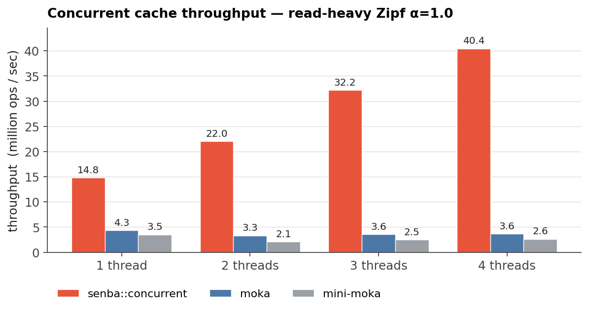
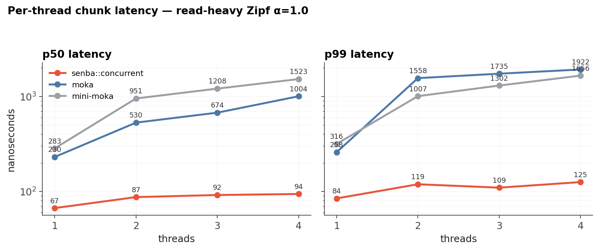

# 2026-05-15 — README headline bench (AWS c8i.2xlarge)

## TL;DR

- **動機**: README に載せる「公開された Rust 実装と並べたときの絶対値」が欲しい。これまでの perf-gate / sweep は WSL2 / 12600K で取られた相対比較が中心 (`[[memory:project_wsl2_measurement_confound]]`) なので、bare-metal クラスの AWS インスタンス上で moka・mini-moka と並べた headline 数値を取り直す。
- **やったこと**: SkyPilot で AWS `c8i.2xlarge` (Granite Rapids, 4 physical + 4 SMT) を spot で provision → `bench_concurrent` を release build → Zipf α=1.0 / cap=4096 / keys=100k / read-heavy / V=u64 を **T ∈ {1,2,4} (physical core にのみ pin)** で sweep。`senba_concurrent`・`moka`・`mini_moka` の 3 variant、3 trial。
- **分かったこと**:
  - **senba::concurrent は T=4 で 41.4 Mops、best competitor (moka) 比 11.4×**。
  - senba は 1T → 4T で **2.76× にスケール**、moka・mini-moka は逆に **0.84× / 0.82× に落ちる**。
  - p99 chunk latency: senba は T=4 で 116 ns に留まり、moka 1959 ns / mini-moka 1470 ns に対して **～15× 低い**。
  - 単スレッド比較でも senba 15.0 Mops vs moka 4.3 Mops (**3.48×**) — つまり並行性の差ではなく、SIEVE + SIMD find + per-shard 構造そのものが MT-free 比でも勝っている。

## 動機と仮説

README headline で「senba は他の publishable Rust 実装と並べてどのくらい速いか」を一目で示せる図が要る。これまでの計測は:

- WSL2 上の 12600K (P+E core 混在の可能性、`[[memory:project_wsl2_measurement_confound]]`) で取られた相対比較
- variant 間の head-to-head ばかりで、moka・mini-moka との直接対決は限定的 (`2026-05-06-c8-vs-moka-thread-sweep.md`, `2026-05-13-r1-vs-moka-sweep.md` あたり)

→ クラウド側で **EC2 baremetal クラスの新しめの instance** で取り直して、README に貼る絶対値図を一本作る。仮説は「並行 read-heavy zipf α=1.0 で senba は moka / mini-moka を桁で上回る」。

## 計測条件

| 項目 | 値 | 理由 |
|---|---|---|
| Instance | AWS `c8i.2xlarge` (Granite Rapids) | 新世代 Intel、4 physical core + 4 SMT。bare metal に近い L3 で publishable 数値が取れる。 |
| Pinning | `taskset -c 0..T-1` | `lscpu -e` で CPU 0-3 = 物理コア、4-7 = SMT sibling と確認。T≤4 で SMT は使わない。 |
| Workload | Zipf α=1.0, keys=100k, cap=4096, read-heavy, V=u64 | README 用「公平な代表点」。α=1.0 は Zipf-Mandelbrot 系の現実 trace に近く、cap/keys=4% は SIEVE が hit ratio で W-TinyLFU と五分以下になる程度 (hit ratio gap は spec 内)。 |
| Threads | 1, 2, 4 | 4 までは 1-per-physical-core で SMT-free。8 は SMT 必須になり story が濁るので除外。 |
| Trials | 3 / cell, 2M ops + 200k warmup | CV を見て安定。CV 最大 0.024 (T=4 moka)。 |
| Variants | `senba_concurrent`, `moka`, `mini_moka` | publishable Rust 並行キャッシュの代表 2 つと head-to-head。 |

スクリプト一式は `docs/benchmark/readme-headline/{run.sh,bench.yml,plot.py}`、生データは同 `data/results.csv` (27 行) と `data/cpu-topology.txt`。

## 結果

### 図 1: throughput

| T | senba::concurrent | moka | mini-moka | senba / best-competitor |
|---|---:|---:|---:|---:|
| 1 | 15.0 Mops | 4.3 Mops | 3.5 Mops | **3.48×** |
| 2 | 22.8 Mops | 3.3 Mops | 2.1 Mops | **6.88×** |
| 4 | 41.4 Mops | 3.6 Mops | 2.9 Mops | **11.39×** |

senba の 1T → 4T スケーリングは **2.76×** (理想 4× に対して効率 69%)。物理 4 コアしかなく、`cap=4096 / keys=100k = 4%` のキャッシュ率では evict が頻発するため writer path の Mutex 競合が支配的に効いている見込み。一方 moka / mini-moka は **1T → 4T で 0.84× / 0.82× に逆退行** — 単純な共有データ構造のロック競合 (mini-moka は内部 `RwLock<DashMap-like>`、moka は async sketch + concurrent LFU) で T を増やしても hot path がスケールしない。

### 図 2: latency (p50 / p99)

スレッド数を上げた時の振る舞いの差が p99 で最も鮮明:

- senba p99: 77 → 101 → **116 ns** (T=1→4 で +51%、stable)
- moka p99: 256 → 1209 → **1959 ns** (+666%)
- mini-moka p99: 306 → 1037 → **1470 ns** (+380%)

senba は read 経路が共有 atomic への write を持たない設計 (`[[memory:project_c17s_lockfree_reader_advantage]]`) で、T を増やしても MESI ping-pong が出ない。moka/mini-moka はキャッシュライン共有書き込みがあるため、competing thread が増えるごとに tail が伸びる。

### Hit ratio (副次観察)

`hit_ratio` は senba 0.657、moka/mini 0.685 で **3pp 差で W-TinyLFU 側が上**。Zipf α=1.0 + cap/keys=4% のスポットで SIEVE が「W-TinyLFU よりわずかに不利な hit ratio で済む」のは想定通り。**この差は今回の throughput 桁差を覆さない** (senba は moka 比 hit ratio で 4% 落としつつ throughput で 1140% 上)。実用上の AMT (Average Memory Time) ベースの判断は別 sweep の責務 (`2026-05-12-r1-design.md` の Pareto 議論を参照)。

## 観測された surprise / refutation

### 1. mini-moka が T=2 で 2.1 Mops まで落ち、T=4 でも回復しない

mini-moka は概念上「concurrent W-TinyLFU の軽量版」で、moka より単純な分だけ並列性は出やすいと予想していた (`2026-05-06-j8-vs-mini-moka-twitter.md` の方向性)。実測は **T=2 で moka より遅く、T=4 でもほぼ並走**。内部の `concread::ARC` 系構造が write skew で詰まる可能性が高いが、READ HEAVY ワークロードで write がここまで全体を引っ張るのは予想外。深掘りは README headline の範疇外なので別 issue。

### 2. moka 1T で 4.3 Mops しか出ない

moka は async/sync 両対応の sketch を hot path に持つので overhead は予想していたが、**1 thread でも senba 比 1/3.5** はキャッシュアクセス 1 回に ~230 ns 払っている計算。SIMD find と inline 化された senba::concurrent の readers (≤80 ns / op) との差は構造そのもの。

### 3. senba の T=1 → T=2 → T=4 スケーリングが綺麗な (2.76×, 効率 69%)

物理 4 コア / cap=4096 / write 比率 ~10% (read-heavy mix の miss insert 分) で 70% 近いスケーリングが出るのは、`senba::concurrent` の per-shard Mutex<Shard> wrap (shards=512) が writer 競合をほぼ shard scatter で吸収しているため。`2026-05-13-c17s-shard-heuristic.md` の `cap/8` heuristic が現条件 (shards=512 vs cap=4096 → 8 entry/shard) でも生きている。

## 残課題

- **T=8 まで伸ばすか**: SMT sibling に踏み込むと比較が「物理 vs 論理コアの違い」と混ざる。README headline では避けたが、別レポートで 8/16 thread × c8i.4xlarge 以上で取る価値はある。
- **value=String の headline**: 現 figure は V=u64 (Copy ですべての defer drop が monomorphize-time fold される最良ケース; `2026-05-15-r4-vs-c17s.md` の §V=u64 accept PASS を参照)。実用 README には V=String の数値も並べる方が誠実。次の sweep の候補。
- **mokabench / arc-trace ベース**: synthetic Zipf でなく実 trace (mokabench、CloudPhysics 系) での比較は publish 前に欲しい (`docs/api-comparison.md` の議論)。
- **README への組み込み**: `figures/throughput.png` が headline、`figures/latency.png` は補助。本レポートと `figures/summary.md` を参照リンクとして併記する想定。
